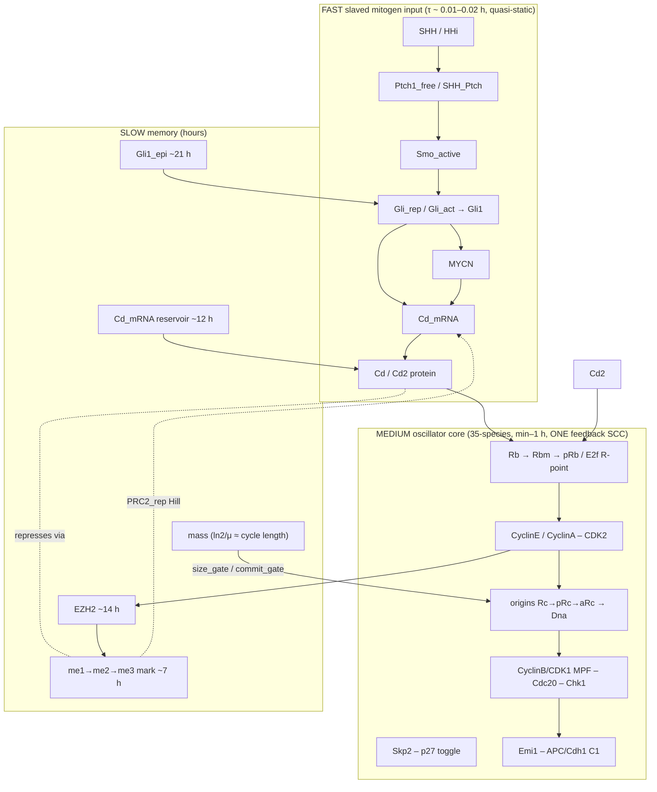

# Model Architecture (current)

> **Scope.** This page describes the *current default* v44 model as it is actually built by `src/build_model_v44_heldt.py` on the `main` branch of the active repo (`.../Ezh2_CyclinD1_Sphase`). It is the authoritative structural reference. For how the model got here see [Evolution timeline](03_evolution_timeline.md); for the mechanisms behind each module see [Mechanisms explored](04_mechanisms_explored.md); for what was tried and dropped see [Things tried and abandoned](05_things_tried_and_abandoned.md); for the fit see [Calibration & validation](06_calibration_and_validation.md).

---

## 1. What the model is, in one paragraph

v44 is a real-time (minutes; **no phenomenological `eps` clock**) single-cell ODE model of the **EZH2 – CyclinD1 – Hedgehog** cell-cycle control circuit in P7 cerebellar granule-neuron precursors (GNP) and SHH-medulloblastoma (MB). It is built by **string surgery on a frozen published core** — Heldt, Barr, Cooper, Bakal & Novák 2018 (*PNAS* 115:2532, BioModels **BIOMD0000000700**), stored as `models_external/heldt2018.ant` and loaded verbatim, then extended. The builder function is:

```python
build_model_v44(hu=None, with_ezh2=True, with_hh=True, with_growth=True,
                with_skp2=True, with_two_step_rb=True, with_cd_sat=True,
                with_h3k27_memory=False, with_h3k27_dilution=True, with_prc2=True,
                with_h3k27_chain=True, with_mother_g2=False, with_ezh2_conc=False,
                with_mitogen_tracker=False, with_diff_gene=False, decouple_commit=True,
                mycn_autoreg=False, with_cdki_species=True, params=None)
```

It returns an **Antimony string** you load with `tellurium.loada(...)`. Every default-on flag is `True`; the `_ts_bake` dict near the end of the file (lines ~944–1008) is the **parameter authority** — it overrides the in-string defaults with the calibrated ("time-series baked") values whenever they are present in the assembled model. User `params={...}` override even that.

Central hypothesis being tested by the architecture: **longer S-phase → more EZH2 → stronger CyclinD1 repression → longer G0/G1**, with EZH2/CyclinD1 acting as a **threshold governor** on a Hedgehog-gated restriction point (not the proliferation on/off switch — that is the low CyclinD1 basal + Gli drive).

---

## 2. The three-tier structure

The single most useful way to read v44 is as a **three-tier machine** (dependency-structure analysis, `simulations/struct/`, memory [`v44-structural-map-3tier`]). Timescales span ~5 orders of magnitude and the tiers are cleanly separated:



**Tier 1 — FAST slaved mitogen input (`HH_MYCN_BLOCK`).** The entire Hedgehog cascade plus the D-cyclins have τ ≈ 0.01–0.02 h, so relative to the ~16–24 h cycle they are algebraically **slaved**: `Cd* ≈ F(SHH, Ptch1_copy_number, EZH2, mark)`. Structurally this is a **feed-forward periphery**, not part of the oscillating feedback core — which is why most tuned dials live here yet the cycle keeps running when you perturb them.

**Tier 2 — MEDIUM oscillator core.** One **35-species strongly-connected feedback component** spanning ~10 sub-modules (Rb-E2f R-point, Skp2-p27 toggle, MPF-Cdc20 relaxation oscillator, replication, Emi1-Cdh1). There are **no isolated sub-loops inside it** — a dial anywhere propagates around all the loops. This tier runs the actual cell cycle.

**Tier 3 — SLOW memory.** `mass` (period timer ≈ ln2/μ), `Gli1_epi` (~21 h Gli autoregulation), `EZH2` (~14 h), the `me1/me2/me3` H3K27me3 mark (~7 h), and the `Cd_mRNA` reservoir (~12 h). These modulate the oscillator. **The EZH2/CyclinD1-fold and G0 phenotype live entirely here** — the reason `Kez_cd` (a slow-integrator transfer function) decoupled the MB/GNP fold while cascade dials did not.

**Structural invariants (verified):** exactly **3 conserved pools** — total Rb = 5 (conserved even across division → the mass gate ≡ Rb-dilution is an exact identity, §4E), total Cdh1 = 1, total Gli = 0.6 (the whole Gli axis is one degree of freedom). True dimension 44. **6 load-bearing dials** whose knockout collapses the cycle: `E2f`, CyclinE, p27-clearance, CyclinD1, `kPhRbCd` (CDK4/6), `mu` (growth). EZH2 feedback is a **separable modulator** (KO breaks only ~7/28 targets, not the cycle).

---

## 3. Tier 1 in detail — Hedgehog → Gli → CyclinD1/D2 + MYCN

`HH_MYCN_BLOCK` ports the v42 signalling cascade onto the Heldt frame. Species: `$SHH, $HHi` (boundary inputs), `SHH_Ptch, Ptch1_free, Ptch1_mRNA, Smo_active, Gli_rep, Gli_act, Gli1_mRNA, Gli1, Gli1_epi, MYCN, Cd_mRNA, Cd, Cd2, Ptch1_slow`.

- **Canonical cascade with feedback.** SHH binds Ptch1 (`k_SHH_Ptch_bind=5.0`), relieving Ptch1's repression of Smo; Smo activates the Gli switch (`Gli_rep ⇌ Gli_act`, Hill switch `K_Smo_Gli_switch=0.888`); `Gli_act`+`Gli1` drive `Cd_mRNA`. **Ptch1 is itself a Gli target** (`k_Ptch1_basal=0.1493`, `k_Ptch1_Gli=1.873`) closing the canonical Gli→Ptch1⊣Smo⊣Gli negative feedback. In MB this loop is **broken**: `Ptch1_copy_number` is the *functional* Ptch1 fraction (gene dosage × competence) — GNP = 1.0, Ptch1+/− = 0.5, **MB-with-LOH = 0.1**. Low functional Ptch1 → constitutive Gli *and* high Ptch1 mRNA (the SHH-MB marker).
- **CyclinD1 transcription** (`CycD1_transcription`, line 338) is `(k_Cd_tx_basal + Gli-Hill·k_Cd_tx_Gli_max + MYCN-Hill·k_Cd_tx_MYCN) × PRC2-repression`. Baked (two-cyclin recal): `k_Cd_tx_basal=0.000529`, `k_Cd_tx_Gli_max=0.152118`, `k_Cd_tx_MYCN=0.031157`. The **very low basal** is load-bearing: it makes proliferation **Shh-dependent by structure** (CyclinD1 needs Gli drive to commit) — so even full de-repression / EZH2 cKO stays Shh-dependent (matches JP's cKO: transcript up, no division at SHH=0).
- **CyclinD1 = the Hedgehog memory carrier** (memory [`v44-cyclind1-hh-memory-carrier`]; Ho, Tsai & Stearns 2020). The memory is the **cumulative `Cd_mRNA` reservoir**, not the protein. Baked `k_Cd_mRNA_deg=0.001` makes the mRNA a **slow ~12 h reservoir** (transcription rates scaled ×1/800 to hold levels); the protein is fast (`k_Cd_deg=1.0`, `k_Cd_translation=0.801`) — a rapid readout. Because Gli raises *both* the transcript and EZH2 (which represses the transcript), **EZH2 is an incoherent feed-forward** on Ccnd1: when mitogen falls, EZH2's repression lifts with a lag → the transcript "stays up," so the cell **coasts ~1 cycle** after Hh-off. `Cd` is **not** reset at division (`E_div`), so the reservoir genuinely carries through mitosis.
- **CyclinD2 as a separate buffered D-cyclin** (memory [`cyclind1-d2-two-cyclin-model`], baked 2026-07-28). `Cd2` = `k_Cd2_bas + Cd2_expr + Gli-Hill·k_Cd2_Gli`, **no dynamic EZH2 repression**. Baked `k_Cd2_bas=2.0, k_Cd2_Gli=2.49, K_Cd2_Gli=0.3`. It feeds the *same* CDK4/6→Rb drive with weight `w_Cd2=0.079448`. Rationale from Chahin RNA-seq: CCND2 is the **dominant** D-cyclin (~83% of the GNP pool) and only drops ~35% under vismodegib (vs D1's ~85%) → total D-cyclin **never collapses** under Hh-block. Constraint: Shh-gating survives only if D2's Gli-independent drive stays below the R-point (`w_Cd2 ≤ 0.2`). Engaging D2 fixed the last non-HU miss (CyclinD1 GNP+HHi 0.055→0.100). Note: making D2 *equally* H3K27me3-marked is **data-incompatible** (flips the vismo direction) — left as opt-in `d2_marked`, default off.
- **MYCN** is elevated in SHH-MB **by expression, not amplification** (memory [`mycn-elevated-expression-not-amplified`]). The old `MYCN_amplification` multiplier and the `mycn_autoreg` latch are **deprecated / inert**; the live mechanism is the additive, Gli-set, MB-specific `MYCN_expr` term (0 in GNP) in `MYCN_synthesis`.
- **Gli1 slow autoregulation** via `Gli1_epi` (a 0–1 chromatin capacitor charged by Smo activity, gated to broken feedback so GNP-silent / MB-active, `k_epi_off=0.0008` ≈ 21 h): reproduces the Gli1 *residual* after vismodegib without inflating proliferation.
- **Opt-in, default-off Tier-1 refinements:** cilium duty cycle (`w_cilium=0`, reception on in G1/S, off at G2 via `Cb`), delayed `Ptch1_slow` adaptation (`k_ptch1_slow_on=0`).

---

## 4. Tier 2 in detail — the oscillator core

### A. Heldt G1/S core (inherited, `heldt2018.ant`)
Species: `Rb, pRb, E2f, RbE2f, E1(Emi1), C1(Cdh1), pC1, E1C1, P21(=p27), Ce(CyclinE), Ca(CyclinA), CeP21, CaP21, aPcna/iPcna, Rc/pRc/aRc/iRc, Dna, P53, Dam`. Restriction point = `Rb ⇌ pRb ⇌ RbE2f`; **E2F positive feedback** (`kSyE2f + kSyE2fE2f·E2f/(jSyE2f+E2f)`); CyclinE/A synthesised ∝ E2f, inhibited by p27, CyclinA degraded by Cdh1; **APC/C-Cdh1** `C1 ⇌ pC1` active in G0/G1, off in S/G2.

### B. Explicit DNA replication + HU coupling (`HU_BLOCK`)
`Synthesis_of_DNA: aRc => aRc + Dna; kSyDna·vfork·aRc` — **`kSyDna` is fork speed** (baked `0.04686` → S ≈ 3.5 h; Heldt's 0.0093 gave an unrealistic ~10 h). This is the whole reason for the v44 rebuild: S-phase duration is now **mechanistic and concentration-dependent** (it was a structural invariant in the v42/v43 Gérard-Goldbeter engine). **HU** slows forks: `vfork := vmin_fork + (1−vmin_fork)·KmHU_fork^h/(KmHU_fork^h+HU^h)` (`vmin_fork=0.1`), so HU lengthens S dose-dependently while G1 is unchanged. HU also blocks S-**entry** (origin firing) via `fire_gate_HU` (`KmHU_fire`, baked `0.2797`), so HU-arrested cells hold at 2N.

### C. CyclinB/CDK1 (MPF) mitotic switch + intra-S checkpoint + real G2 (`MITOSIS_BLOCK`, redesign #1)
Heldt is a one-shot G1/S model with no mitosis. v44 adds `MPF, preMPF, Cdc20` with `Cb := MPF+preMPF`. **Cdc25/Wee1 hysteresis** (`Cdc25a` MPF-activated/Chk1-inhibited; `Wee1a` MPF-inhibited/Chk1-activated; basal `a25=0.02, aWee=0.1`, `KmMpf=0.35, nMpf=4`). **CHK1 intra-S checkpoint** `Chk1 := aRc/(jChk+aRc)` holds MPF off until forks disassemble (`Dna→1, aRc→0`). **Real multi-hour G2**: CyclinB is made (as inactive `preMPF`) only as replication completes — `SynCycB: => preMPF; kSyCb·g2gate`, `g2gate := Dna^nG2/(KG2^nG2+Dna^nG2)` (`kSyCb=0.020, KG2=0.85, nG2=6`) → G2+M ≈ 3.3 h. **APC/Cdc20** (MPF-activated) destroys CyclinA/B → mitotic exit.

### D. Division reset (`E_div` event)
`E_div: at (MPF > MPF_div)` builds a true G1 daughter: `Dna=0`, re-license origins (`Rc=1`), Rb dephosphorylation *with* Spencer carryover, `P21` reset high, `Skp2=0.05` (low), `Ce=Ce_div, Ca=Ca_div` (low), `E1/=2`, `MPF=preMPF=Cdc20=0`, `mass/=2`, `EZH2/=2, EZH2m/=2`. The **Spencer commitment carryover** `f_commit_carry` (baked `0.3745`) is load-bearing: `f_commit_carry=0` hard-resets every G1 (looks like arrest); >0 lets a committed daughter inherit a fraction of the mono+hyper Rb and CyclinE states (immediate re-entry) while uncommitted daughters reset toward G0. Note **`EZH2` is diluted (÷2) at division, not preserved** (`with_ezh2_conc=False`, the default) — this is what makes an *elongated / HU-arrested* S accumulate EZH2 (dividing cells reset it; arrested cells bank it).

### E. Growth-gated restriction point = the Rb-dilution timer (`GROWTH_BLOCK`, redesign #2)
`mass` grows exponentially (`Growth: => mass; mu_eff·mass`) and halves at division (size homeostasis). A **size gate on S-entry** (`size_gate := mass^n/(M_size^n+mass^n)`, baked `M_size=3.14`, `n_size=6`) makes committed cells **wait for size** before replicating, so **G1 length = growth time, decoupled from CyclinD level** — high-CyclinD MB no longer collapses G1 to zero. This is *algebraically identical* to an **Rb-dilution restriction point** (Zatulovskiy 2020): Heldt's total Rb is conserved, so `[Rb] ∝ 1/mass`, and `mass^n/(M^n+mass^n)` ≡ `Krb^n/(Krb^n+[Rb]^n)`. Baked growth rate `mu=0.000769` (≈ 16 h GNP core cycle); MB is slowed by its higher INK4 via `k_mu_cki=0.3619` (`mu_eff := mu/(1+k_mu_cki·(p16+p18))·(...)` → GNP ~17 h / MB ~24–26 h *emerges* from the CDKi, not a separate knob). Latent graded-G1-lengthening (`mu_min_frac=0.4, K_g1len=0.6`) engages only under deep mitogen withdrawal.

### F. Skp2–p27 feed-forward R-point (`SKP2_BLOCK`, redesign #3)
Heldt's `Skp2` was constant; here it is a **dynamic E2F target degraded by APC/C-Cdh1**: `Skp2_synthesis: => Skp2; kSySkp2bas + kSySkp2·E2f + kSySkp2_Cd·Cd/(K_Skp2_Cd+Cd)` and `Skp2_degradation_Cdh1: Skp2 => ; kDeSkp2C1·C1·Skp2`. In G0, E2F-off + active Cdh1 keep Skp2 low → p27 not degraded → p27 high (self-reinforcing, p27-positive transient G0). Commitment: CyclinD partial Rb-P → some E2F → Skp2 rises → p27 degraded → CyclinE/CDK2 active → Cdh1 phosphorylated off → Skp2 stabilised → full Rb-P. **This double-negative feed-forward is the bistable R-point** (the commitment threshold is a sharp ~166%/unit-birth-p27 switch). A **mitogen-dose Skp2 term** (`kSySkp2_Cd=0.24457, K_Skp2_Cd=10.296`) raises Skp2 in high-CyclinD1 MB → Skp2 MB/GNP 2.31 (data ~2.3×).

### G. Two-step Rb R-point (`_apply_two_step_rb`, default on)
Heldt's single `Rb→pRb` conflated mono- and hyper-phosphorylation. v44 splits it (Narasimha 2014 / Sanidas 2019 biology): `Rb → Rbm` (**mono**, CyclinD-CDK4/6, size-gated) `→ pRb` (**hyper**, CyclinE/A, releases E2f). E2f stays bound on `Rb` and `Rbm`, released only at the hyper step; `pRb := Rbh` is the experimental phospho-Rb(Ser807/811) marker, so **G0 = pRb-negative now coincides with p27-positive**. New species: `Rbm, RbmE2f`. The **CDK4/6 drive is saturating and competitively braked**: `cdk_d = kPhRbCd·(Cd + w_Cd2·Cd2)/(K_CdRb·(1 + p18_prot + p19_prot + w_p27·(P21+p21a)) + (Cd + w_Cd2·Cd2))`. Baked `kPhRbCd=0.1403, K_CdRb=0.4032, kDsRbmE2f=1.882`, `M_commit=2.476`. With `decouple_commit=True` (default flipped 2026-07-27) the commit gate is dropped from p27-clearance so the **G0→G1 threshold is governed purely by the CyclinD1/CDKi balance + birth-p27** (growth-independent) — this is what lets the fast 16 h core keep a strong commitment threshold *and* preserve cKO Shh-dependence.

### H. Dynamic-CDKI module (`with_cdki_species=True`, **baked default 2026-07-30**, commit ec1a141)
The lumped static `p16/p18` + single `P21` is replaced by **individually expressed CDK-inhibitor species** (memory [`dynamic-cdki-module`], `docs/cdki_module_design.md`):
- **INK4 → CDK4/6:** `p18_prot` (Cdkn2c, dominant) + `p19_prot` (Cdkn2d) as protein species relaxing to expression-set targets (`p18=0.464, p19=0.36`; turnover `kDe_p18=0.003` stable, `kDe_p19=0.03` short-lived). p16/p15 dropped (silent in GNP). Brake = `1 + p18_prot + p19_prot + w_p27·(P21+p21a+p57a)`.
- **CIP/KIP → CDK2:** `P21`(=p27, the dominant functional pool) + `p21a`(Cdkn1a) + `p57a`(Cdkn1c), each with own CyclinE/A-CDK2 sequestration complexes (`Cep21a/Cap21a`, `Cep57a/Cap57a`). **p21 carries the PCNA/Rc + CRL4-Cdt2 arm** (moved off p27 — p27 has no PIP box). `p21a`/`p57a` are structurally present but calibrated **inert (~0)** — engaging them at data-transcript levels over-inhibits CDK2 and breaks validation (a genuine finding: mRNA abundance overstates the active nuclear CDKI pool for p21/p57).
- **p27 clearance** = basal + **KPC** (constant, mitogen-insensitive, free-pool only, `kDeKPC=0.02022`) + SCF-Skp2. The old CDK4/6-activity-gated clearance is **removed**.
- **CdP21 — the new Shh-gated commitment lever:** `Cd + P21 ⇌ CdP21` (Cd consumed → saturating buffer; buffered Cd returned to the Rb-drive numerator = "option A"; INK4 promotes release). Baked `kSeqCd=2.13243, kRelCd=0.01647, w_ink4=3.6204, kSyP21=0.00116`. High Shh → high Cd → buffer p27 → commit; SHH=0 → low Cd → free p27 rises → arrest. Not reset at division.

---

## 5. Tier 3 in detail — EZH2 and the H3K27me3 mark

### EZH2 layer (`EZH2_CORE_BLOCK`)
Species `EZH2m` (transcript), `EZH2` (protein). **EZH2 is a Rb-E2f target → it tracks both mitogen dose and cycle phase** (memory [`ezh2-tracks-mitogen-rb-e2f`]; Chahin Fig 4: CyclinD1 MB/GNP 5.07×, EZH2 MB/GNP 2.05×, palbociclib drops Ezh2 −55.6%). Transcription (line 210) is a cycle-gated term (`E2f × (wCe·Ce + (1−wCe)·Ca)`, S-window) **times a mitogen-dose factor** `Cd/(Kez_cd+Cd)` that saturates (baked `Kez_cd=9.176`) so the ~7× CyclinD1 fold compresses to ~2× EZH2, **plus a cycle-flat baseline** `kEZbas_Cd` (carries the dose ratio without a within-cycle swing). Baked: `kEZbas=0.000622, kEZbas_Cd=0.000318, kEZE2f=0.01226, K_E2f_EZ=0.4498`. **Protein is stable** (`kDeEZ=0.0002766`, t½ ~14 h) so it **integrates S-phase duration**, plus an **APC/Cdh1-gated degradation** `kDeEZ_C1=0.000386` (`EZH2_deg: kDeEZ + kDeEZ_C1·C1`) that clears EZH2 in G0 but stabilises it in S/G2/arrest → elongated/HU-arrested S banks EZH2 (HU EZH2-in-S boost 1.24×). `EZH2i` toggles the feedback (1 = EZH2 inhibitor). Two p27 readouts: `P21` (functional, cycle-coupled) vs `P27_total := P21 + P27_wide` (IHC-comparable, drives nothing).

### H3K27me3 mark — serial methylation chain + PRC2 occupancy (`with_h3k27_dilution + with_prc2 + with_h3k27_chain`, all default on)
This is the **default repression path** (the older direct-EZH2 term `K_EZH2_repression` is **dynamically dead** here). The mark is resolved into a **serial me-chain**: implicit `me0 → m1_me → m2_me → Mk(=me3)`, with `me0→me1, me1→me2` fast (`kme1=9.71, kme2=8.27`) and **`me2→me3` slow / rate-limiting** (`kme3=4.56`) — this gives me3 an accumulation *lag* and makes it a division-timing readout. PRC2 is split into two synonyms so **EZH2i models a catalytic (SAM-competitive) inhibitor** that blocks *writing* but leaves the complex bound:
- `PRC2 := EZH2·(1−EZH2i)·(a0_prc2 + a_rw_prc2·Mk^n_rw)·(1 − g_prc2·tx-Hill)` — **catalytic**, drives the me-chain, EZH2i-blocked.
- `PRC2_rep := EZH2·(a0_prc2 + a_rw_prc2·Mk^n_rw)·(1 − g_prc2·tx-Hill)` — **occupancy**, represses CyclinD1, *no* EZH2i factor.

CyclinD1 repression is a **leaky frequency-acting Hill on occupancy**: `f0_prc2 + (1−f0_prc2)/(1 + (PRC2_rep/K_prc2)^n_prc2)` — it dampens, never locks out. Baked: `a0_prc2=0.002875, a_rw_prc2=0.002266, g_prc2=0.07049, K_prc2=0.006857, n_prc2=4.016, f0_prc2=0.17483, del_mk=0.00044`. The reciprocal `(1 − g_prc2·Cd_mRNA^p/(K_tx_mk^p+…))` arm = nascent-transcription eviction of PRC2 (a double-negative → bistable-capable). Effective mark decay is three terms: **δ_eff = del_mk + k_jmjd3_gli·Gli1 + ln2/Tc**.

**The four "more-biological" mark mechanisms** (memory [`v44-four-mark-mechanisms`], baked 2026-07-21, all validation-preserving, added no-op then engaged in `_ts_bake`):
1. **Nerfed Gli→JMJD3/KDM6B eraser** `k_jmjd3_gli=0.005` (vs the optimizer's 0.108, ~21× nerf) — mitogen-gated me3 stripping, the mechanistic source of ChIP **MB < GNP**.
2. **Cooperative read-write** `n_rw=2` (`a_rw_prc2·Mk^n_rw`) — the bistable/latch-capable EED-spreading nonlinearity.
3. **Continuous fork-gated S-dilution** `dil_frac=0.0, k_dil_S=0.693` — replaces the discrete `at(Dna>0.05): Mk=0.5·Mk` halving so an *elongated* S dilutes concurrently.
4. **H3.3/HIRA transcription-coupled turnover** `k_h33=0.003` — replication-*independent* me3 loss, higher where Ccnd1 is transcribed.

Net effect: ChIP Mk MB/GNP flipped from 1.010 (flat/wrong) to **0.959 (MB<GNP, correct direction)** while the CyclinD1 fold barely moved (28/29 held). Magnitude is limited because the mark is still saturated ~0.98 (the open de-saturation job, walled by [`v44-chromatin-memory-validation-bound`]).

---

## 6. Inputs / condition switches

Set at runtime (`rr['SHH']=…`) or via `build_model_v44(params={...})` for `const` parameters:

| Input | Meaning | GNP | MB |
|---|---|---|---|
| `SHH` | Hedgehog ligand (boundary) | 0.5 | 0.5 |
| `Ptch1_copy_number` | functional Ptch1 fraction | 1.0 | 0.1 |
| `MYCN_expr` | additive Gli-set MB elevation (replaces `MYCN_amplification`) | 0 | >0 |
| `Cd2_expr` | MB CyclinD2 developmental elevation | 0 | set per-cond |
| `HHi` / `GDC0449` | SMO inhibitor / vismodegib (0–1) | 0 | 0 |
| `HU` | hydroxyurea (0=none, 1≈10 µM) | 0 | 0 |
| `EZH2i` | EZH2-inhibitor toggle (1 = writing OFF) | 0 | 0 |
| `p18/p19` (`p16`) | INK4 tone (MB higher) | p18=0.464, p19=0.36 | elevated (env P18_MB≈1.73) |

**Phase markers:** G0 = `pRb` low **OR** `P21` high; G1 = pRb⁺ & p27⁻, pre-S; S = `aRc` high & `Dna<~0.98`; G2/M = `Dna≥~0.98` to division.

---

## 7. Build flags — what is on, what is off, why

| Flag | Default | Role |
|---|---|---|
| `with_ezh2` | **True** | EZH2 layer + dynamic `Cd` (else Heldt const `Cd=0.65`) |
| `with_hh` | **True** | full Hedgehog/MYCN module (else `CD_PLACEHOLDER_BLOCK`) |
| `with_growth` | **True** | mass growth + size/commit gates (Rb-dilution R-point) |
| `with_skp2` | **True** | dynamic Skp2-p27 feed-forward R-point |
| `with_two_step_rb` | **True** | mono(Rbm)/hyper(pRb) Rb split + saturating braked CDK4/6 drive |
| `with_cd_sat` | **True** | saturating CyclinD1→Rb drive (only used when *not* two-step; two-step bakes its own) |
| `with_h3k27_dilution` | **True** | mean-field mark module = the **default repression** |
| `with_prc2` | **True** | formal PRC2 occupancy carries repression (mark = read-write amplifier) |
| `with_h3k27_chain` | **True** | serial me0→me1→me2→me3 chain with slow rate-limiting me3 |
| `decouple_commit` | **True** | commitment governed by CyclinD1/CDKi + birth-p27, growth-independent (flipped 2026-07-27) |
| `with_cdki_species` | **True** | individual dynamic CDKIs (p18/p19/p27/p21/p57) (**baked 2026-07-30**) |
| `with_h3k27_memory` | False | explicit inherited mark memory variant (takes priority if on) |
| `with_ezh2_conc` | False | preserve EZH2 across division (loses S-elongation banking) |
| `with_mother_g2` | False | ⚰️ gravestone — mother-G2 p27 integrator, settled negative result |
| `with_mitogen_tracker` | False | ⚰️ gravestone — mitogen-deficit birth-p27 tracker, wrong sign for MB |
| `with_diff_gene` | False | passive bivalent differentiation-gene sentinel (validation-neutral) |
| `mycn_autoreg` | False | deprecated/inert — the failed acute MYCN self-activation latch |

For the full narrative of *why* each of these arrived (and which were reverted), see [Evolution timeline](03_evolution_timeline.md) and [Mechanisms explored](04_mechanisms_explored.md).

---

## 8. Current fit and known structural limits

The default build validates **30/32** (dynamic-CDKI default) — up from the 28/29 of the pre-CDKI two-cyclin model. The **only failures are the structural HU pair** (MB HU-S + MB HU-G2), an anti-correlated wall where in-model BrdU is replication flux (memory [`v44-hu-s-g2-structural-limit`]). Confirmed default behaviours: GNPs proliferate only under Hedgehog; GNP−SHH and GNP+HHi quiesce; EZH2 cKO stays Shh-dependent (transcript up, no SHH=0 division); CyclinD1 MB/GNP ~5×; EZH2 MB/GNP 2.05×; Skp2 MB/GNP 2.31; D2 folds; CDK4/6i ± EZH2i checks; GNP ~17 h / MB ~24–26 h cycle dichotomy emerging from INK4. See [Calibration & validation](06_calibration_and_validation.md) for the full target ledger and [Reviewer & open questions](10_reviewer_and_open_questions.md) for the mark-saturation and p21/p57-identifiability caveats.

**Caveat on the docs:** `docs/v44_MODEL_DESCRIPTION.md` (dated 2026-07-14) predates the two-cyclin, dynamic-CDKI, MYCN_expr, and decouple_commit bakes — it still describes `MYCN_amplification`, `P21_div`, and a single-`P21` CKI. Where it disagrees with `src/build_model_v44_heldt.py` / `_ts_bake`, **the builder is authoritative**. See [Repos, directories & reproduction](09_repos_directories_reproduction.md) for how to build and run.
